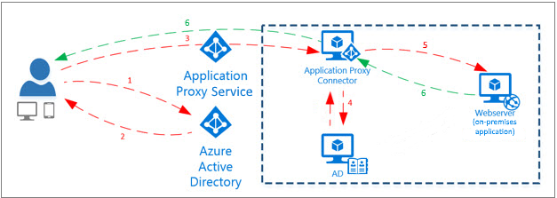
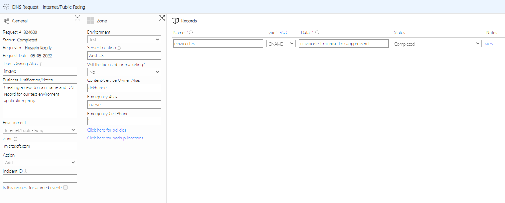

# Overview

## What is Application Proxy
AAD Application Proxy is a secure remote access solution for on-premises application.
It helps to publish an external HTTPS URL endpoint in Azure which connects to an internal applicatiuon server URL in private organization netwrok.  

  

All interanl users (FTEs) can access the application thru the internal URL or the external URL (thru the proxy). All external users (supplier users) will need to be invited as a guest account in order to login to the application. 

## Configuring Application Proxy for MS Invoice classic
Once you have the servers and site running and accessable thru an internal URl, you can follow these steps to configure the Application Proxy:
- Create an ICM ticket for `Identity SRE/Azure AD Application Proxy` team by following the template provided
    - The team will be responsible for creatig the enterprise applications in AAD, and configure the connectors.
    - They should also give us ownership to the new created application
    - The team will share the external URL `<custom url>-microsoft.msappproxy.net`
- Create an ACL request for allowing Application Proxy connectors connect to MS Invoice Backend servers. Check out the [FAQ](https://microsoft.sharepoint.com/sites/Identity_Authentication/SitePages/CertificateServices/Azure-App-Proxy.aspx) section for more details.
- Generate a new certificate for the new external URL and share it securly with the app proxy team, so they can configure the application with the custom external URL.
- Once the app proxy team finish creating the application in AAD, get the appication ID and [submit a rquest](https://aka.ms/adminconsent) to the tenant admin to allow guest accounts login to the new application that app proxy team created.
- Submit a DNS request to the [Domain Manger](https://prod.msftdomains.com/) to add a CNAME record for mapping the external URL to the app proxy's external URL.

## Current Configuration
- DEV Enviroment
    - Application Name: AAP Einvoice Dev
    - Application ID  : 43b12b83-7f58-400a-8563-a2fcc3f4a5be

- TEST Enviroment
    - Application Name: AAP Einvoice Test
    - Application ID  : 15c6d044-184a-4f91-b51f-a71fa7ed3e1e

- PROD Enviroment
    - Application Name: AAP Einvoice PROD
    - Application ID: b5b97451-c66d-4f35-bc22-f7a20e2209a4

## Support
For any issue with the aplication proxy, please create an ICM ticket for the `Identity SRE/Azure AD Application Proxy` team. 